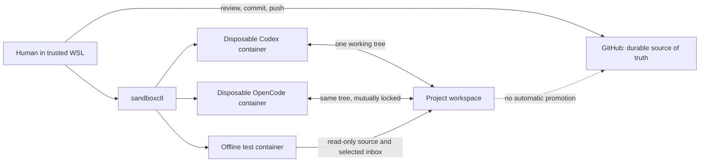

# Codex Sandbox Kit

Codex Sandbox Kit runs Codex and OpenCode in disposable Docker containers from
WSL. It gives either agent access to one selected Git working tree without
mounting the rest of the WSL home, Windows files, host credentials, or the
Docker socket.

This is an experimental personal project for repositories you own and review.
It is useful for adding separation to everyday agent work, but it is not a
general sandbox for untrusted repositories. GitHub is treated as the durable
copy of a project; the local WSL working tree may be discarded.

## Features

- One launcher for setup, checks, agent sessions, and maintenance.
- Separate pinned images and per-project logins for Codex and OpenCode.
- A project lock stops both agents using the same working tree at once.
- The repository is writable, while `.git` is read-only. Git commits and
  pushes are intended to happen from WSL.
- Containers omit broad host mounts, drop Linux capabilities, use read-only
  root filesystems, and have their mount lists checked before startup.
- An offline runner can use selected private fixtures without network access or
  a Codex installation.

## Architecture and trust model

The launcher runs in WSL and creates containers directly with Docker. It checks
the final container configuration before startup. The agent does not receive
the Docker socket, and editor-added Dev Container mounts are not involved.



Codex and OpenCode use the same project layout but separate images and
authentication volumes. Normal sessions mount the repository, read-only
`.git`, scratch space, and an outbox. Both agents mount their authentication
volumes read-only during task, shell, and exec sessions. Codex mounts
authentication read-write only for login and logout; its status command is
read-only. OpenCode retains its separate authentication-command behavior. The
offline runner instead gets read-only source and selected private input, with
Docker networking disabled and no Codex installed.

The project does not guarantee protection from Docker or kernel vulnerabilities,
safe handling of arbitrary malicious repositories, protection of the active
agent credential from repository code, or preservation of the writable working
tree. Repository text and dependencies can influence the agent. See the
[security notes](docs/MAINTAINER-SECURITY.md) for exact implementation details.

## Prerequisites

- Windows with WSL 2 and a Linux distribution.
- An x86-64 Docker environment available from WSL, with permission to use its
  daemon. The default project settings request 6 CPUs and 8 GiB of memory;
  lower values can be set in `control/project.env`.
- Bash, Git, and Python 3.11 or newer (static checks use `tomllib`).
- Standard GNU/Linux command-line tools, including `realpath`, `findmnt`,
  `mountpoint`, `sha256sum`, and `xargs`.
- Internet access for image builds and networked agent sessions.
- A ChatGPT login for Codex and a supported provider login for OpenCode.

The launcher defaults to `$HOME/agent-workspaces`. Set `CODEX_SANDBOX_WORKSPACES_ROOT` before invoking it for another WSL location.

## Quick start

Clone this repository to a trusted WSL location, then run:

```bash
cd codex-sandbox-kit
bin/sandboxctl build
bin/sandboxctl init my-project
git clone https://github.com/OWNER/REPOSITORY.git \
  "$HOME/agent-workspaces/my-project/repo"
bin/sandboxctl doctor my-project
bin/sandboxctl login my-project
bin/sandboxctl run my-project
```

Create or check out a trusted baseline commit before an agent session. Afterward, review and promote from WSL:

```bash
cd "$HOME/agent-workspaces/my-project/repo"
git status --short
git diff
cd /path/to/codex-sandbox-kit
bin/sandboxctl package my-project
```

For OpenCode, use the parallel command family:

```bash
bin/sandboxctl doctor-opencode my-project
bin/sandboxctl login-opencode my-project
bin/sandboxctl run-opencode my-project
```

See the [operator guide](docs/OPERATOR-GUIDE.md) for offline validation,
review, authentication cleanup, and troubleshooting.

## Common commands

| Purpose | Codex | OpenCode |
| --- | --- | --- |
| Validate | `bin/sandboxctl doctor <slug>` | `bin/sandboxctl doctor-opencode <slug>` |
| Start agent | `bin/sandboxctl run <slug>` | `bin/sandboxctl run-opencode <slug>` |
| Diagnostic shell | `bin/sandboxctl shell <slug>` | `bin/sandboxctl shell-opencode <slug>` |
| Run a command | `bin/sandboxctl exec <slug> -- <command>` | `bin/sandboxctl exec-opencode <slug> -- <command>` |
| Check login | `bin/sandboxctl auth-status <slug>` | `bin/sandboxctl auth-status-opencode <slug>` |
| Log out | `bin/sandboxctl logout <slug>` | `bin/sandboxctl logout-opencode <slug>` |
| Delete auth | `bin/sandboxctl destroy-auth <slug> --yes` | `bin/sandboxctl destroy-opencode-auth <slug> --yes` |

Shared commands:

```bash
bin/sandboxctl build
bin/sandboxctl init <slug>
bin/sandboxctl offline <slug> -- <command>
bin/sandboxctl package <slug>
```

## Tests

Docker-free and model-free release checks:

```bash
bash tests/static.sh
```

Docker-based, model-free smoke checks (not part of the Docker-free release check):

```bash
bash tests/smoke.sh
bash tests/smoke-opencode.sh
```

## Project status and limitations

This is an experimental personal project. It is not production-grade, formally
security-audited, or independently audited. Use it for personal, reviewed
repositories, not arbitrary untrusted code.

Repository code can access the internet and the agent credential available to
that project, change or delete the working tree, and write files for later
review. Read-only authentication mounts prevent task code from changing the
persisted credential, but do not prevent it from reading or using that
credential. The offline runner can copy private input to its outbox. Review
remains necessary.

Codex credential refreshes made during a task remain in disposable
`CODEX_HOME` and are not written back to the read-only authentication volume.
If the stored credential later stops working, run `bin/sandboxctl login
<slug>` again.

The implementation was developed with coding-agent assistance. The author's
role covered requirements, threat-model decisions, testing, debugging, and
validation.

Projects must use a normal `.git` directory; linked Git worktrees, which use a
`.git` file, are not accepted by the launcher. The supplied images provide a
general Node/TypeScript development base, not every project's dependencies.
Compatible custom image names can be set in `control/project.env`, but those
images must retain the labels and entrypoints expected by the launcher.

Containers are removed after normal commands, but project directories,
authentication volumes, outbox files, and host-side reports persist until the
user removes them.

Detailed documentation:

- [Operator Guide](docs/OPERATOR-GUIDE.md)
- [Maintainer and Security Reference](docs/MAINTAINER-SECURITY.md)

## License

MIT. See [LICENSE](LICENSE).
